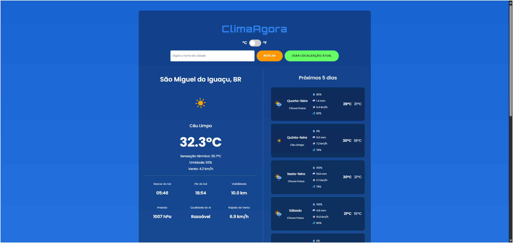
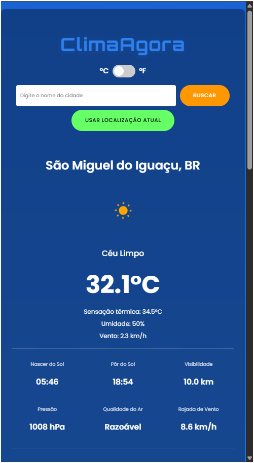

# ClimaAgora: Aplicativo de Previsão do Tempo

Um aplicativo web simples e elegante para consultar o clima atual, previsões futuras e outros dados meteorológicos de qualquer cidade do mundo, construído com JavaScript puro e uma API de back-end em Node.js para maior segurança.

---

### 📸 Screenshots

| Versão Desktop | Versão Mobile |
| :---: | :---: |
|  |  |

---

### ✨ Funcionalidades Principais

*   **Clima Atual:** Exibe temperatura, sensação térmica, umidade, velocidade do vento e descrição do clima.
*   **Busca Inteligente:** Busca por qualquer cidade do mundo com sugestões de autocompletar.
*   **Geolocalização:** Botão para obter o clima da localização atual do usuário.
*   **Previsão para 5 Dias:** Resumo diário com temperaturas máxima/mínima e condições do tempo.
*   **Previsão Hora a Hora:** Detalhes das próximas 24 horas.
*   **Detalhes Adicionais:** Informações como nascer/pôr do sol, visibilidade, pressão e qualidade do ar.
*   **Mapa Interativo:** Mapa do Leaflet com camadas de precipitação, nuvens, temperatura e mais.
*   **Interface Responsiva:** Design que se adapta perfeitamente a desktops, tablets e celulares.
*   **Segurança:** A chave da API é protegida por um servidor back-end, não ficando exposta no código do cliente.

---

### 🛠️ Tecnologias Utilizadas

*   **Front-End:**
    *   HTML5
    *   CSS3 (com Variáveis, Flexbox e Grid)
    *   JavaScript (ES6+) (com `async/await` e `fetch`)
    *   [Leaflet.js](https://leafletjs.com/) para o mapa interativo.
*   **Back-End:**
    *   Node.js
    *   Express.js
    *   Dotenv
    *   CORS
*   **APIs:**
    *   [OpenWeatherMap API](https://openweathermap.org/api)
*   **Deployment:**
    *   O back-end está hospedado no [Render](https://render.com/).
    *   O front-end pode ser hospedado em qualquer serviço de site estático (GitHub Pages, Netlify, Vercel).

---

### 🚀 Como Executar Localmente

Este projeto é dividido em duas partes: **Back-end** (o servidor que protege a API) e **Front-end** (a interface que o usuário vê). Você precisa rodar os dois.

**1. Configurando o Back-end:**

```bash
# Navegue até a pasta do back-end
cd backend

# Crie uma cópia do arquivo de exemplo de ambiente
# (No Windows, use copy)
copy .env.example .env

# Abra o arquivo .env e adicione sua chave da OpenWeatherMap
# OPENWEATHERMAP_API_KEY=SUA_CHAVE_VEM_AQUI

# Instale as dependências do servidor
npm install

# Inicie o servidor (ele ficará rodando em http://localhost:3000)
npm start
```

**2. Abrindo o Front-end:**

Com o servidor back-end rodando, simplesmente abra o arquivo `index.html` na raiz do projeto no seu navegador de preferência.

---

### 🌟 Melhorias Futuras

*   [ ] Adicionar testes unitários para as funções de manipulação de dados.
*   [ ] Melhorar a acessibilidade (ARIA).

---

### 🙏 Créditos

*   Os ícones de clima utilizados neste projeto foram criados pela [amCharts](https://www.amcharts.com/) e estão licenciados sob a [Creative Commons Attribution 4.0 International](https://creativecommons.org/licenses/by/4.0/).
